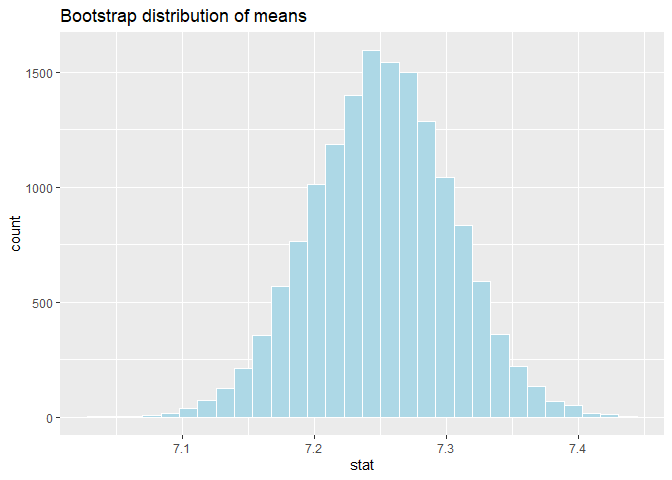
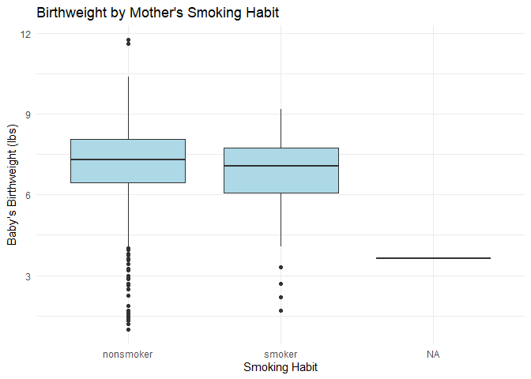

Lab 12 - Smoking during pregnancy
================
Jamieson Nathan
4/20/2025

### Load packages and data

``` r
library(tidyverse) 
library(infer)
library(openintro)
library(infer)
```

### Exercise 1

``` r
nrow(ncbirths)
```

    ## [1] 1000

There are 1000 cases in this dataset!

### Exercise 2

``` r
ncbirths_white <- subset(ncbirths, whitemom == "white")

mean_weight <- mean(ncbirths_white$weight, na.rm = TRUE)
mean_weight
```

    ## [1] 7.250462

``` r
boot_df <- ncbirths_white %>%
  specify(response = weight) %>% 
  generate(reps = 15000, type = "bootstrap") %>% 
  calculate(stat = "mean")

ggplot(data = boot_df, mapping = aes(x = stat)) +
  geom_histogram(bins = 30, fill = "lightblue", color = "white") +
  labs(title = "Bootstrap distribution of means")
```

<!-- -->

``` r
null_dist <- boot_df %>%
  mutate(stat = stat - mean(stat) + 7.43)

obs_stat <- mean(ncbirths_white$weight, na.rm = TRUE)

p_value <- mean(abs(null_dist$stat - 7.43) >= abs(obs_stat - 7.43))
p_value
```

    ## [1] 0.0006666667

Because the p-value indicates significance, we reject the null
hypothesis. There is strong statistical evidence that the average
birthweight of babies born to White mothers has changed since 1995.

Specifically, the average appears to have decreased from 7.43 pounds to
7.25 pounds in this sample.

### Exercise 2

``` r
ggplot(ncbirths, aes(x = habit, y = weight)) +
  geom_boxplot(fill = "lightblue") +
  labs(title = "Birthweight by Mother's Smoking Habit",
       x = "Smoking Habit",
       y = "Baby's Birthweight (lbs)") +
  theme_minimal()
```

<!-- -->

``` r
ncbirths_clean <- ncbirths %>%
  filter(!is.na(habit) & !is.na(weight))

ncbirths_clean %>%
  group_by(habit) %>%
  summarize(mean_weight = mean(weight))
```

    ## # A tibble: 2 × 2
    ##   habit     mean_weight
    ##   <fct>           <dbl>
    ## 1 nonsmoker        7.14
    ## 2 smoker           6.83

``` r
obs_diff <- ncbirths_clean %>%
  specify(response = weight, explanatory = habit) %>%
  calculate(stat = "diff in means", order = c("nonsmoker", "smoker"))

null_dist <- ncbirths_clean %>%
  specify(response = weight, explanatory = habit) %>%
  hypothesize(null = "independence") %>%
  generate(reps = 10000, type = "permute") %>%
  calculate(stat = "diff in means", order = c("nonsmoker", "smoker"))

p_val <- null_dist %>%
  get_p_value(obs_stat = obs_diff$stat, direction = "two-sided")

boot_dist <- ncbirths_clean %>%
  specify(response = weight, explanatory = habit) %>%
  generate(reps = 10000, type = "bootstrap") %>%
  calculate(stat = "diff in means", order = c("nonsmoker", "smoker"))

ci <- boot_dist %>%
  get_confidence_interval(level = 0.95, type = "percentile")

ci_low <- ci$lower_ci
ci_high <- ci$upper_ci
```

The observed difference in average birth weights between babies of
nonsmoking and smoking mothers was **0.32 pounds**, with babies of
smokers weighing less on average.

A permutation test using 10,000 simulations yielded a **p-value of
0.0314**, indicating the difference is **statistically significant** at
the 0.05 level.

A 95% confidence interval for the difference in means ranged from **0.06
to 0.58 pounds**, suggesting we can be 95% confident that babies of
nonsmoking mothers weigh between that range more than babies of smokers.

Therefore, maternal smoking is associated with a statistically and
practically significant reduction in birth weight.

### Exercise 3

``` r
table(ncbirths$mature)
```

    ## 
    ##  mature mom younger mom 
    ##         133         867

``` r
ncbirths %>%
  group_by(mature) %>%
  summarize(min_age = min(mage, na.rm = TRUE),
            max_age = max(mage, na.rm = TRUE),
            mean_age = mean(mage, na.rm = TRUE))
```

    ## # A tibble: 2 × 4
    ##   mature      min_age max_age mean_age
    ##   <fct>         <int>   <int>    <dbl>
    ## 1 mature mom       35      50     37.2
    ## 2 younger mom      13      34     25.4

I determined the age cutoff for mature mothers by examining the
relationship between the mature and mage variables. I grouped the data
by the mature category and summarized the range of maternal ages in each
group. The results show that mothers classified as “mature” are 35 years
old or older, while “younger moms” are under 35

For the following hypothesis testing:

- p₁ = proportion of low birthweight babies among mature mothers

- p₂ = proportion among younger mothers

**H₀: p₁ = p₂ (no difference in proportions)**

**Hₐ: p₁ \> p₂ (mature mothers have a higher proportion of low
birthweight babies)**

``` r
table(ncbirths$mature, ncbirths$lowbirthweight)
```

    ##              
    ##               low not low
    ##   mature mom   18     115
    ##   younger mom  93     774

Since each group has more than 10 cases, we can proceed to hypothesis
test.

``` r
ncbirths_lowbw <- ncbirths %>%
  filter(!is.na(mature) & !is.na(lowbirthweight)) %>%
  mutate(lowbw_binary = ifelse(lowbirthweight == "low", "low", "not low"))

obs_lowbw_diff <- ncbirths_lowbw %>%
  specify(response = lowbw_binary, explanatory = mature, success = "low") %>%
  calculate(stat = "diff in props", order = c("younger mom", "mature mom"))

obs_lowbw_stat <- obs_lowbw_diff$stat

null_lowbw_dist <- ncbirths_lowbw %>%
  specify(response = lowbw_binary, explanatory = mature, success = "low") %>%
  hypothesize(null = "independence") %>%
  generate(reps = 10000, type = "permute") %>%
  calculate(stat = "diff in props", order = c("younger mom", "mature mom"))

lowbw_pval <- null_lowbw_dist %>%
  get_p_value(obs_stat = obs_lowbw_stat, direction = "right")

boot_lowbw_dist <- ncbirths_lowbw %>%
  specify(response = lowbw_binary, explanatory = mature, success = "low") %>%
  generate(reps = 10000, type = "bootstrap") %>%
  calculate(stat = "diff in props", order = c("younger mom", "mature mom"))

lowbw_ci <- boot_lowbw_dist %>%
  get_confidence_interval(level = 0.95, type = "percentile")

lowbw_ci_lower <- lowbw_ci$lower_ci
lowbw_ci_upper <- lowbw_ci$upper_ci
```

The observed difference in proportions of low birthweight babies (mature
– younger) was -0.028.

A permutation test using 10,000 simulations yielded a p-value of 0.868,
which is not statistically significant at the α = 0.05 level.

A 95% confidence interval for the difference in proportions ranged from
-0.09 to 0.033. Since the interval contains 0, this supports the
conclusion that mature mothers are not more likely to have low
birthweight babies.
